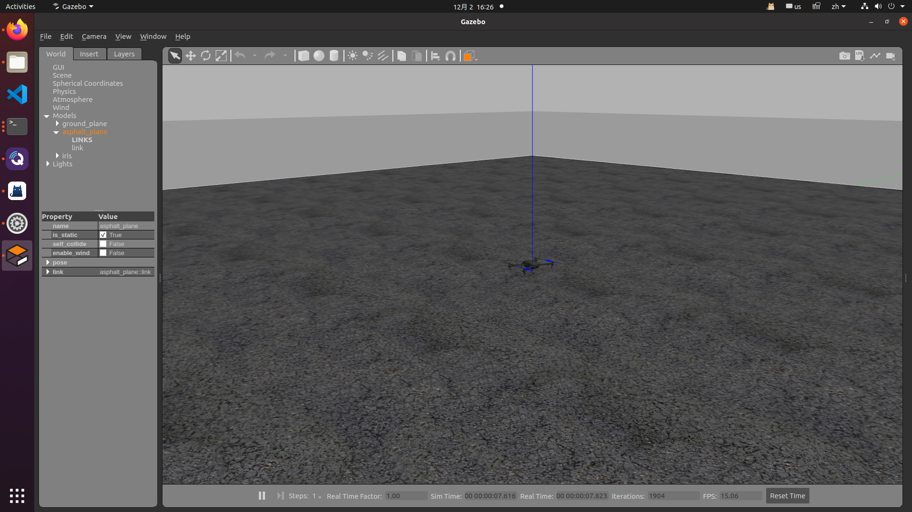
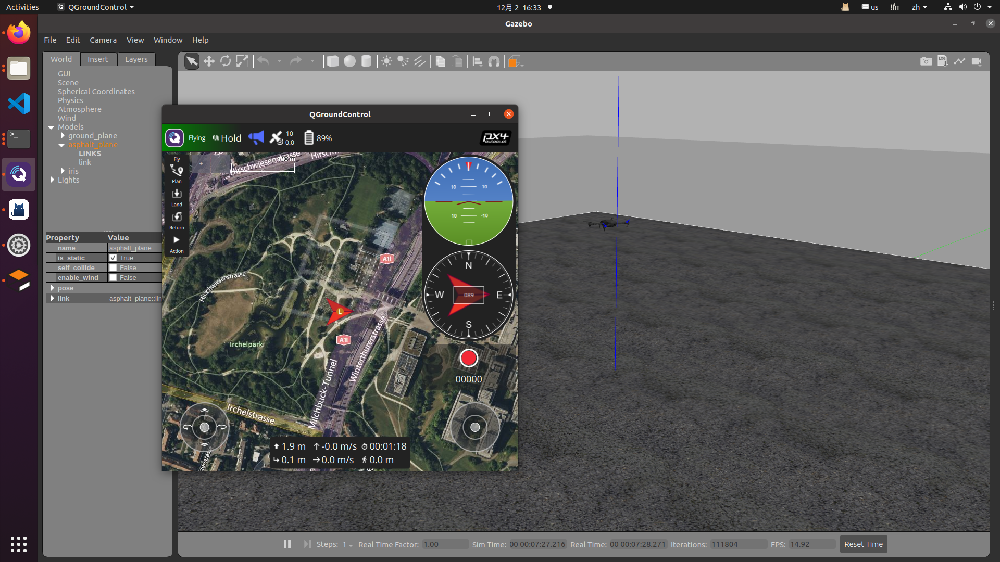
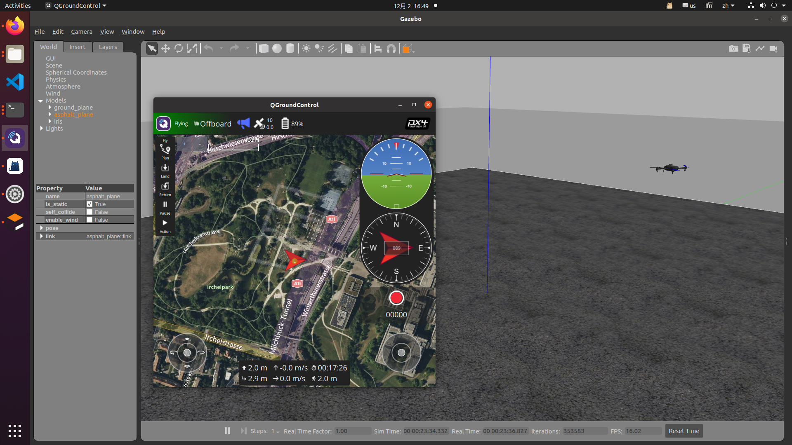

# 在gazebo模拟PX4实机实验流程
通常px4实机实验的流程，一般如下，具有更高的安全性：
1. 先切换至position模式，然后起飞无人机
2. 运行后端代码
3. 遥控器切换至OFFBOARD模型，无人机执行任务

为了在仿真环境中对标这个流程，这个仓库实现了相应的过程，本仓库使用python语言实现，流程较为简单，如果需要cpp版本可以让AI帮忙转化一下

> **注意事项**

1. 由于使用python实现，可以编译，也可以不编译，我这里是**直接使用python的方式启动**而非rosrun的方式
2. 可以放在工作空间的功能包下，这里用第二种方式演示
```shell
cd ~
mkdir -p catkin_ws/src
cd catkin_ws/src
# 克隆本仓库
git clone https://github.com/ANITYi/px4_real_control_example.git
# 如果修改cpp的版本就需要自己修改并编译，使用rosrun的方式也要编译，建议先跟着我这个流程操作一遍
```
## >0 启动px4 gazebo仿真环境
默认这里是安装了px4，不再赘述
```shell
# 新打开一个终端
roslaunch px4 mavros_posix_sitl.launch
```
启动后如下：  


## >1 无人机自动起飞
**这一步对标真实环境下，遥控器控制无人机起飞并悬停在第一个位置**  
运行如下脚本：
```shell
# 新建一个终端
cd ~/catkin_ws/src/px4_real_control_example/scripts/
# 无人机就会自动起飞并悬停，可能要10s中，耐心等待即可，这个脚本运行完后会自动结束的
python3 take_and_park.py
```
会看到如下界面,无人机飞到`z=2m`的位置，（如果有QGCGround，会看到QGC模式为HOLD）


## > 2 启动第三方脚本
这里脚本是指，比如想用位置控制、速度控制、路径规划、目标跟踪等等脚本  
**这一步就是对标真机实验是启动OFFBOARD模型下的控制脚本**    


**>Q: 为什么先启动这个脚本?**  
**>A: 使用OFFBOARD模式时，后端必须要有代码持续给mavrox发消息，否则就算切换了OFFBOARD后2s内也会切换回来，所以是无效的**
```shell
# 新建一个终端
cd ~/catkin_ws/src/px4_real_control_example/scripts/
# 启动第三方脚本，
python3 control_dummy.py
```

## > 3切换OFFBOARD模式
**这一步对标的是真机实验中人为的用遥控器切换OFFBOARD模式**
```shell
cd ~/catkin_ws/src/px4_real_control_example/scripts/
# 注意这个第三个参数， 目前是两种方式可选[OFFBOARD | AUTO.LOITER]
# 对应遥控器上的波动的开关 切换为OFFBOARD模式以后无人机就会飞到指定位置了
python3 mode_switcher.py OFFBOARD
# 如果切换为自动悬停的按钮
python3 mode_switcher.py AUTO.LOITER
```
切换成offboard模式如下，也可以在QGC中看到为offboard模型（不一定要有QGC）  



